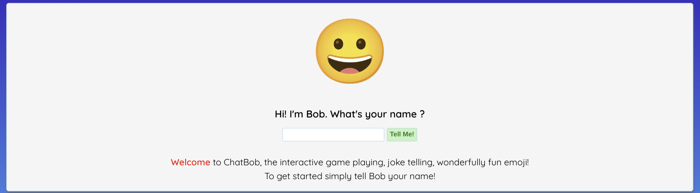
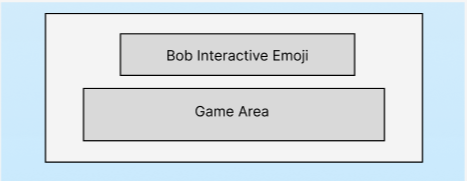
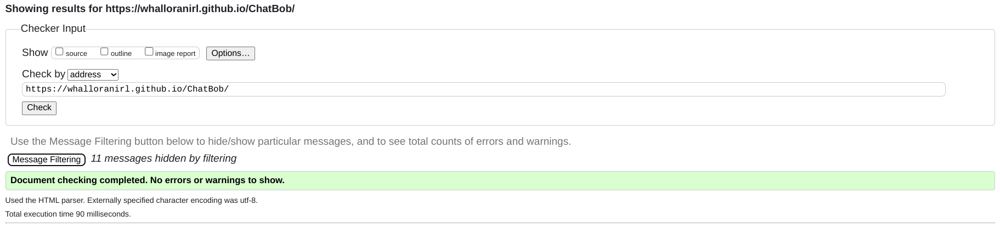

## ChatBob Games

### Project Description

This is a simple gaming site for users to have some fun, interacting and playing games with an emoji character called Bob. There will be jokes & games.

### Table of Contents

- [ChatBob Games](#chatbob-games)
  - [Project Description](#project-description)
  - [Table of Contents](#table-of-contents)
- [Roadmap](#roadmap)
- [UX](#ux)
  - [User Goal](#user-goal)
  - [User Story](#user-story)
  - [Owner Goals](#owner-goals)
- [Design](#design)
  - [Font](#font)
  - [Colors](#colors)
  - [Emoji](#emoji)
  - [Structure](#structure)
- [Wireframes](#wireframes)
- [Features](#features)
  - [Navigation](#navigation)
  - [ChatBob](#chatbob)
  - [Quiz](#quiz)
  - [Jokes](#jokes)
  - [Rock Paper Scissors](#rock-paper-scissors)
- [Technologies](#technologies)
  - [Language](#language)
  - [Tools](#tools)
  - [Frameworks & Libraries](#frameworks---libraries)
- [Validation](#validation)
- [Testing](#testing)
- [Bugs](#bugs)
- [Deployment](#deployment)
  - [Steps to Deploy:](#steps-to-deploy-)
- [Thank You / Credits](#thank-you---credits)

<small><i><a href='http://ecotrust-canada.github.io/markdown-toc/'>Table of contents generated with markdown-toc</a></i></small>

## Roadmap

- Create frontend and emoji character
- Create form to capture user info
- Create games
- Create jokes
- Create interactivity for users to access games and play
- Create feedback loops from games
- Capture user info for free prize draw

## UX

### User Goal

- Familiar design, mobile first
- Clear and quality images
- Easily navigatable
- Positive feedback from Bob
-

### User Story

- As a user, I want to be able to navigate the website easily
- As a user, I want it clear what the object of the app is
- As a user, I want to be able to navigate the games easily
- As a user, I want to be able to quit the games easily
- As a user, I want to have fun and be entertained
- As a user, I want some reward for completing the games

### Owner Goals

- Increase ranking on search engines
- Capture user info
- Repeat visits

## Design

### Font

In order to get a nice feel and complementary fonts I used Quicksand from [Google Fonts](https://fonts.google.com/) in order to select the best fonts I felt for the page. Using [Google Fonts](https://fonts.google.com/).

### Colors

- I chose a simple faded blue background using the following colours and css

background: rgb(41, 41, 190); background: linear-gradient(180deg, rgba(41, 41, 190, 1) 0%, rgba(0, 212, 255, 1) 100%);

- Font is black
- Container is #f5f5f5

### Emoji

I used [Animated Emojis](https://googlefonts.github.io/noto-emoji-animation/) to display different emojis depending on the user interation.

### Structure

Based on current user experiences, I am choosing to go with a Mobile first approach. I am trying to avoid any scrolling to keep the app in a single container page.

I am choosing JS to help create the page based on user interaction and hide/show elements seemlessly as needed.

## Wireframes

Using Figma I have created initially the mobile first look and feel then scaled based on larger screen requirements. As Bob updates via javascript the page will not change and the basic structure reamains the same.



## Features

### Navigation

- Minimal design with no navigation menu or bars

### ChatBob

- An interactive emjoi that will respond to user inputs

### Quiz

- A 10 question quiz that is randomly ordered for users to play

### Jokes

- A set of jokes for the user to interact with

### Rock Paper Scissors

- RPS game with a first to 10 winner

## Technologies

### Language

- HTML
- CSS
- JavaScript

### Tools

- VSCode
- Github
- Figma
- HTML Validator
- CSS Validator
- Unsplash

### Frameworks & Libraries

- [Google Fonts](https://fonts.google.com/)
- [Font Awesome](https://fontawesome.com)
- [Animated Emojis](https://googlefonts.github.io/noto-emoji-animation/)

## Validation

- Html validation 

- CSS validation 

## Testing

Testing was completed on multiple devices to ensure responsiveness. All links and possible click-throughs were also tested.

| Feature | Description | Steps | Outcome |
| --- | --- | --- | --- |
| Homepage responsiveness | Verify the responsiveness of the homepage on different screen sizes. | 1. Open the website on a desktop browser. 2. Resize the browser window to simulate different screen sizes (e.g., desktop, tablet, mobile). | The homepage content adjusts smoothly to fit various screen sizes without layout issues. |
| Message input functionality | Ensure the message input field is functional and accepts user input. | 1. Visit the ChatBob webpage. 2. Click on the message input field. 3. Type a message and press Enter. | Messages are successfully entered into the input field and displayed in the chat interface. |
| Response generation | Test the chatbot's ability to generate responses based on user input. | 1. Type a message in the input field and press Enter. 2. Observe the response generated by the chatbot. | The chatbot generates coherent responses relevant to the input message. |
| User interaction | Interact with ChatBob through multiple selections of buttons and text. | 1. Engage in a game play. 2. Evaluate the chatbot's responses for coherence and relevance. | ChatBob responds as expected. |

## Bugs

| Bug | Status | Description | Steps To Resolve |
| --- | --- | --- | --- |
| Homepage layout issue | Resolved | The layout of the homepage is not properly adjusting on smaller screen sizes, causing content to overlap or become inaccessible. | 1. Identify CSS rules responsible for page layout. 2. Implement responsive design techniques to ensure content displays correctly on all screen sizes. |
| Input field alignment | Resolved | The message input field is not aligned properly with the chat interface, resulting in a visual inconsistency. | 1. Inspect CSS styles applied to the input field and chat interface elements. 2. Adjust styling to ensure consistent alignment across different screen sizes. |

## Deployment

ChatBob can be easily deployed using GitHub Pages, which allows you to host static websites directly from a GitHub repository.

### Steps to Deploy:

1. **Fork the Repository:** Fork the [ChatBob repository](https://github.com/whalloranirl/ChatBob) to your own GitHub account by clicking the "Fork" button in the top-right corner of the repository page.

2. **Clone the Repository:** Clone your forked repository to your local machine using Git:

   ```bash
   git clone https://github.com/your-username/ChatBob.git

   ```

3. **Edit Configuration (Optional):** If necessary, customize the ChatBob project according to your preferences or requirements. You can modify the chatbot's behavior, add new features, or update the styling.

4. **Access Your Deployed Site:** Once GitHub Pages has finished deploying your site, you can access it at the following URL:

[https://your-username.github.io/ChatBob/](https://your-username.github.io/ChatBob/)

## Thank You / Credits / Resources

Youtube - WebDev ChatGPT Code Institute Mate Racz

- [Simen Daehlin](https://github.com/Eventyret)
